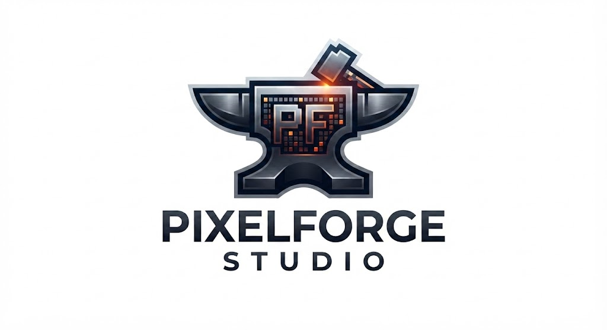

# 

# PixelForge Studio

> **Forging games from scratch.**

PixelForge Studio is an independent game development studio focused on creating fun, creative and polished games.

We're building our projects from the ground up, experimenting with new ideas and learning with every project.

---

##  Our Games

### Freebuild.lol

**Freebuild.lol** is PixelForge Studio's current flagship project.

A fast-paced freebuilding game focused on movement, building, editing and combat.

**Status:**  In Development

### Current Development

* [x] Player movement
* [x] Sprinting
* [x] Jumping
* [x] Mouse movement
* [x] Character animations
* [x] Main menu
* [x] Loading system
* [x] Lobby
* [x] Settings
* [ ] Building system
* [ ] Building editing
* [ ] Weapons
* [ ] Combat
* [ ] Multiplayer
* [ ] Matchmaking
* [ ] Final UI
* [ ] Public release

---

##  Technology

PixelForge currently uses:

* **Unity** — Game Engine
* **C#** — Gameplay & systems
* **Blender** — 3D modelling
* **GitHub** — Version control & collaboration
* **HTML / CSS / JavaScript** — Web development

---

##  Repository

This repository contains PixelForge Studio development resources, documentation and project files.

> Repository structure may change as PixelForge projects grow.

---

##  Development

PixelForge Studio is currently in its early stages.

We're focusing on building a strong foundation before expanding into larger projects.

Our development philosophy is simple:

**Build it. Test it. Improve it. Ship it.**

---

## 🎯 Studio Goals

* Create games that are genuinely fun to play
* Build polished experiences from scratch
* Experiment with new gameplay ideas
* Improve our development skills with every project
* Build a community around PixelForge
* Release multiple games over time

---

##  Roadmap

### PixelForge Studio

* [ ] Establish studio branding
* [ ] Launch studio website
* [ ] Set up development infrastructure
* [ ] Build PixelForge community
* [ ] Release first game
* [ ] Begin additional projects

### Freebuild.lol

* [x] Core player controller
* [x] Camera system
* [x] Character animations
* [x] Main menu
* [x] Lobby
* [x] Settings
* [ ] Building
* [ ] Editing
* [ ] Weapons
* [ ] Combat
* [ ] Multiplayer
* [ ] Testing
* [ ] Beta
* [ ] Release

---

##  Team

PixelForge Studio is currently an independent development project.

As the studio grows, additional developers, artists, designers and other contributors may join the team.

---

##  Documentation

More documentation is available through the [PixelForge Studio Wiki](../../wiki).

Development documentation will be expanded as the studio and its projects grow.

---

##  Links

**Studio:** PixelForge Studio
**Main Project:** [Freebuild.lol](NOT OUT YET)
**GitHub:** [PixelForge Studio](https://github.com/crypticfn2012-jpg/PixelForgeSudios)

---

**PixelForge Studio**

*Forging games from scratch.*

