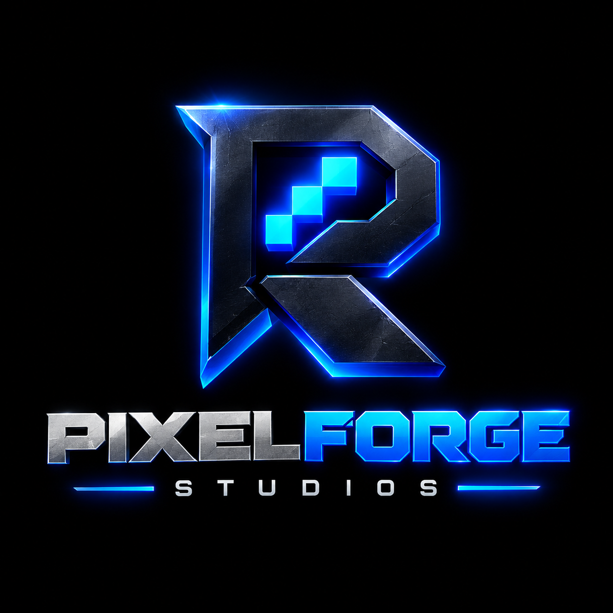

# 

# PixelForge Studios

> **Forging games from scratch.**

PixelForge Studios is an independent game development studio focused on creating fun, creative and polished games.

We're building our projects from the ground up, experimenting with new ideas and learning with every project.

---

## Our Current Game

### Penguin Plunge

**Penguin Plunge** is PixelForge Studios' main focus.

A fun browser game inspired by the chaotic, colourful and competitive style of games like **Fall Guys**. Take control of a penguin, jump into different challenges and compete to make it to the end.

The **Penguin Plunge beta is coming soon**.

**Status:** 🟡 Beta Coming Soon

### What to Expect

* Fun browser-based gameplay
* Penguin characters
* Chaotic obstacle courses
* Fall Guys-inspired party game style
* Competitive challenges
* More content planned for future updates

---

## Former Project

### Freebuild.lol

**Freebuild.lol** was previously PixelForge Studios' main development project.

Development focus has now shifted away from Freebuild.lol so that the team can concentrate on **Penguin Plunge**.

Freebuild.lol may remain as a past project, but it is no longer the studio's primary focus.

---

## Technology

PixelForge Studios works with a range of tools and technologies, including:

* **Unity** — Game development
* **C#** — Gameplay & systems
* **Blender** — 3D modelling
* **GitHub** — Version control & collaboration
* **HTML / CSS / JavaScript** — Web development
* **Web technologies** — Browser game development

---

## Team

### Ron

**Founder & Co-Owner**

Ron is the founder of PixelForge Studios and co-owner of Penguin Plunge.

### TTVRampage1

**Co-Owner & Developer**

**TTVRampage1** is a developer and co-owner of Penguin Plunge, working alongside Ron to develop and grow the game.

GitHub: [TTVRampage1-tech](https://github.com/TTVRampage1-tech)

---

## Development

PixelForge Studios is currently focused on getting **Penguin Plunge** ready for its upcoming beta.

Our development philosophy is simple:

**Build it. Test it. Improve it. Ship it.**

---

## Studio Goals

* Create games that are genuinely fun to play
* Build polished experiences from scratch
* Experiment with new gameplay ideas
* Improve our development skills with every project
* Build a community around PixelForge Studios
* Release and support Penguin Plunge
* Continue creating new games in the future

---

## Roadmap

### Penguin Plunge

* [x] Begin development
* [x] Establish the core game concept
* [ ] Finish beta development
* [ ] Internal testing
* [ ] Public beta
* [ ] Community feedback
* [ ] More maps and challenges
* [ ] Future updates

### PixelForge Studios

* [x] Establish the studio
* [x] Begin development on Penguin Plunge
* [x] Build the Penguin Plunge team
* [ ] Grow the community
* [ ] Release Penguin Plunge beta
* [ ] Continue expanding the studio
* [ ] Begin future projects

---

## Community & Links

### Penguin Plunge

**YouTube:** [PenguinPlungeOfficial](https://www.youtube.com/@penguinplungeofficial)

**Discord:** [Join the Penguin Plunge Discord](https://discord.gg/vaxBhvxuWr)

### PixelForge Studios

**GitHub:** [PixelForge Studios](https://github.com/crypticfn2012-jpg/PixelForgeSudios)

---

**PixelForge Studios**

*Forging games from scratch.*

